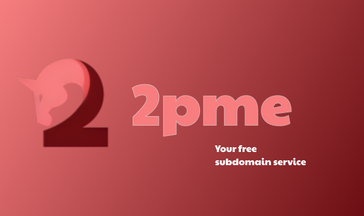

<a href="https://2peek.me" style="display: block; text-align: center;">
  
  <h1 align="center">2Peek.Me</h1>
</a>


<p align="center">
  Create subdomains, for free.
</p>

<p align="center">
  <a href="#introduction"><strong>Introduction</strong></a> ·
  <a href="#features"><strong>Features</strong></a> ·
  <a href="#deployment"><strong>Deployment</strong></a> ·
  <a href="https://2peek.me"><strong>Documentation</strong></a> ·
  <a href="#faq"><strong>FAQ</strong></a>
</p>
<br/>

## Introduction

`2Peek.Me` (also `2pme`) is a free and opensource dns manager to manage subdomains via cloudflare.

## Features

2pme provides a full https api with simple api keys managment, where everyone can get unlimited subdomains for free.

## Deployment

Here are few simple steps to easily deploy 2pme api for your own domain.

### 1. Requirements
Please be sure your hosting platform has the following software installed:

| **Component**              | **Software/Extension**              | **Minimum Recommended Version** | **Notes**                                                                                 |
|----------------------------|-------------------------------------|----------------------------------|-------------------------------------------------------------------------------------------|
| **Web Server**             | Apache                              | 2.4+                             | Or Nginx (1.18+) configured with `php-fpm`.                                              |
|                            | Nginx                               | 1.18+                            | Ensure PHP is properly integrated.                                                        |
| **PHP**                    | PHP                                 | 7.4+ (8.1 recommended)           | PHP must include the following extensions:                                                |
|                            | `mysqli` Extension                  | Included in PHP                  | For connecting to MySQL.                                                                  |
|                            | `json` Extension                    | Included in PHP                  | For encoding and decoding JSON data.                                                     |
| **Database**               | MySQL                               | 5.7+ (8.0 recommended)           | Or MariaDB (10.3+).                                                                          |
| **SSL/TLS**                | SSL Certificate                     | Required for HTTPS               | Use Let's Encrypt or another certificate provider.                                        |


### 2: Clone this repository locally
Use the following command to clone this repository
```sh
$ git clone https://github.com/douxxu/2pme-api
```

### 3: Update the secrets.php file
Find and open the file located at `src/api/utils/secrets.php` and edit the variable content following the given instructions. Make sure you have your domain name servers parked on [cloudflare](https://dash.cloudflare.com).

### 4: Deploy your api
Upload all the directories that are in `src/` into your file server (can be in a subdir like `api/`, not in root).

### 5: Enjoy !
Your 2pme api is now installed !

## FAQ

### Is there a command line tool to manage subdomains ?
**Yes**, you can find it on [NPM](https://npmjs.com/package/2pme) or make your own version out of the [Source code](https://git.douxx.tech/2pme-cli).

### Is there a dashboard to manage subdomains ?
**Not actually**, but it will probably be made.

### Is there a python api wrapper ?
**No**, and i'm not planing to make one. You can easily use the `requests` module and the [documentation](https://2peek.me) to make one yourself.

## License
This project (and all other related projects) is licensed under the [GPL-3.0](LICENSE) license.